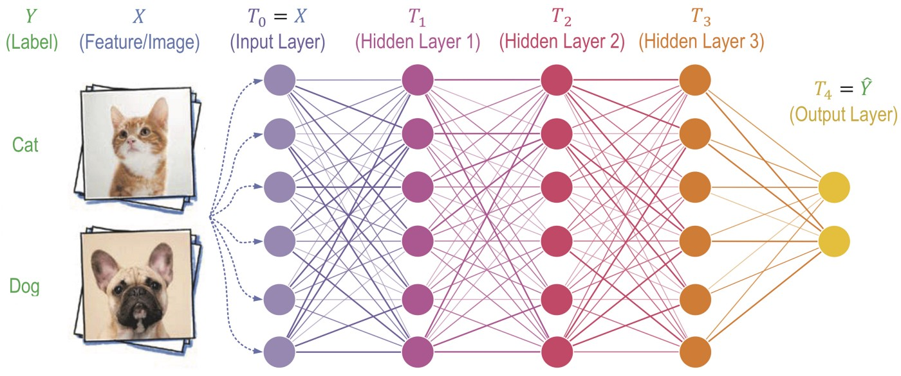

## Introduction

### "Generative" versus "discriminative" learning

What we mean by saying that a model is "generative"? You may be familiar with the common machine-learning task of recognizing images. A dataset of labeled images of, say cats or dogs, are fed into a neural network. By properly defining a loss function, one can optimize the network parameters by comparing its predictions with the ground-truth labels. This is generally known as the **discriminative learning**. Mathematically, this simply amounts to fitting a function $\boldsymbol{y} = f(\boldsymbol{x})$ or a conditional probability distribution $p(\boldsymbol{y} | \boldsymbol{x})$, where $\boldsymbol{x}$ and $\boldsymbol{y}$ stand for the input data and output labels, respectively.   



**Generative learning**, on the other hand, goes a step further by considering the joint probability distribution $p(\boldsymbol{x}, \boldsymbol{y})$ of both data and labels. In this way, one can not only perform discrimination tasks as described above, but also **generate new data** from the posterior probability $p(\boldsymbol{x} | \boldsymbol{y})$, hence the origin of the topic name. Generally speaking, generative learning aims at the modeling, sampling and training of high-dimensional probability distributions. Even in the scenario of unsupervised learning where the labels are lacking, one can still obtain useful information by investigating the probabilistic structure $p(\boldsymbol{x})$ of the raw data.

### Basic formulation

We demonstrate the basic idea of generative modeling by considering the task of **density estimation**: given a set of (unlabeled) data $\{\boldsymbol{x}^{(n)}\}_{n=1}^N$, we would like to approximate the underlying distribution $q(\boldsymbol{x})$ of the data by a probabilistic model $p(\boldsymbol{x}; \boldsymbol{\theta})$, where $\boldsymbol{\theta}$ denotes the parameters. To facilitate the training of the model, we need a loss function that measures the dissimilarity between the two distributions. One common choice is the [Kullback-Leibler (KL) divergence](https://en.wikipedia.org/wiki/Kullback%E2%80%93Leibler_divergence), defined by

<center>
    \begin{equation}
    	\mathrm{KL}(q||p) = \int d\boldsymbol{x} q(\boldsymbol{x}) \ln\frac{q(\boldsymbol{x})}{p(\boldsymbol{x})}.
	\end{equation}
</center>

Using the [Jensen's inequality](https://en.wikipedia.org/wiki/Jensen%27s_inequality), it is easy to prove that $\mathrm{KL}(q||p) \geq 0$, where the equality holds only when the two probability distributions $q(\boldsymbol{x})$ and $p(\boldsymbol{x})$ coincide. The ground-truth distribution $q(\boldsymbol{x})$ for the data is generally unknown, and one has to replace it by the empirical density based on the given dataset:

<center>
    \begin{equation}
    	q_\textrm{data} (\boldsymbol{x}) = \frac{1}{N} \sum_{n=1}^N \delta(\boldsymbol{x} - \boldsymbol{x}^{(n)}).
    \end{equation}
</center>

The loss function $\mathcal{L}(\boldsymbol{\theta})$ is then given by

<center>
    \begin{align}
    	\mathcal{L} &= \mathrm{KL}(q_\textrm{data}(\boldsymbol{x}) || p(\boldsymbol{x}; \boldsymbol{\theta})) \\
    	&= -\frac{1}{N} \sum_{n=1}^N \ln p(\boldsymbol{x}^{(n)}; \boldsymbol{\theta}) + \textrm{const}.
    \end{align}
</center>

Apart from an unimportant constant with no dependence on the model parameters, this is known as the **negative log-likelihood** of the model; its minimization is well-known in statistics as the **maximum likelihood estimation**. In practice, the optimization of the model can be achieved by computing the gradient $\nabla_\boldsymbol{\theta} \mathcal{L}$ of loss function w.r.t. the parameters using the technique of [automatic differentiation](https://en.wikipedia.org/wiki/Automatic_differentiation).

Density estimation is a data-driven approach, and it is by no means the only application of generative learning. In the context of scientific applications, for example, people are typically interested in target distributions $q(\boldsymbol{x})$ that are not specified by data, but by certain domain-specific laws inherent to the system considered. Many fundamental principles of nature are formulated in terms of probabilities. To name an example, in the discipline of **statistical mechanics**, it is known that the thermodynamic properties of a classical system is specified by the **Boltzmann distribution** of the underlying microscopic degrees of freedom:

<center>
    \begin{equation}
    	q(\boldsymbol{x}) = \frac{1}{Z} e^{-E(\boldsymbol{x}) / k_B T},
    \end{equation}
</center>

where $E(\boldsymbol{x})$ is the energy function of the system for certain configuration $\boldsymbol{x}$, $T$ the temperature, $k_B$ the Boltzmann constant , and $Z$ is a normalization constant, which is also known as the partition function. Below we adopt the conventional notation $\beta = 1/k_B T$. Given a probabilistic model $p(\boldsymbol{x}; \boldsymbol{\theta})$, we can then write the loss function as

<center>
    \begin{align}
    	\mathcal{L} &= \mathrm{KL}(p(\boldsymbol{x}; \boldsymbol{\theta}) || q(\boldsymbol{x})) \\
    	&= \mathop{\mathbb{E}}_{\boldsymbol{x} \sim p(\boldsymbol{x}; \boldsymbol{\theta})} \left[ \ln p(\boldsymbol{x}; \boldsymbol{\theta}) + \beta E(\boldsymbol{x}) \right] + \ln Z \\
    	&= \beta(F(\boldsymbol{\theta}) - F_0).
    \end{align}
</center>

Notice that in the last line we have defined the **variational free energy**

<center>
    \begin{equation}
    	F = \mathop{\mathbb{E}}_{\boldsymbol{x} \sim p(\boldsymbol{x}; \boldsymbol{\theta})} \left[ \frac{1}{\beta} \ln p(\boldsymbol{x}; \boldsymbol{\theta}) + E(\boldsymbol{x}) \right],
    \end{equation}
</center>

which is an upper bound of the **true free energy** $F_0 = -\frac{1}{\beta} \ln Z$ of the system. This is known as the **Gibbs-Bogoliubov-Feynman variational free-energy principle** in statistical mechanics. As an example, in the next section we will use this variational principle to investigate the thermodynamics of some interacting particles trapped in a harmonic potential, which can be used to describe systems like a quantum dot. This will also give us the opportunity to inspect various practical aspects of generative modeling, such as model architecture design, Monte Carlo sampling, evaluating gradients, optimization algorithms, and so on.

```
aaaNote:aaaa
```


